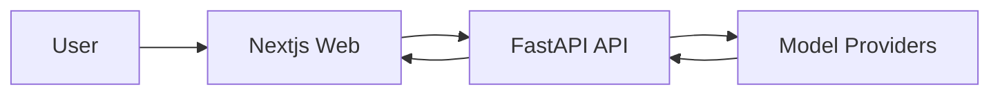
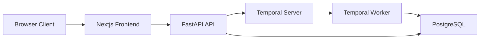
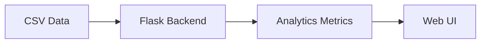

# Shrikanth V
Full-stack engineer focused on AI-enabled products and data-rich web applications—shipping stateless generation pipelines, workflow-orchestrated platforms, and analytics dashboards across Python and TypeScript.

---

## Tech Stack
| Category | Technologies |
|----------|-------------|
| Languages |    |
| Backend & APIs |   |
| Frontend & UI |  |
| Data & Storage |    |
| ML & Analytics |   |
| DevOps & Cloud |  |

---

## Featured Projects

### [confer-marketing-pipeline](https://github.com/shrikanthv15/confer-marketing-pipeline)
> Stateless AI marketing asset generator with a FastAPI orchestrator and Next.js 16 UI—BYOK key pass-through, parallel calls to multiple image/video model providers, and downloadable outputs.




| | |
|---|---|
| **Stack** | Python, FastAPI, TypeScript, Next.js |
| **Highlights** | Stateless architecture with no DB or accounts, BYOK via browser LocalStorage per-request, parallel multi-provider generation for images and video |

### [Git-Repo-Organizer](https://github.com/shrikanthv15/Git-Repo-Organizer)
> Full-stack Git repository analysis and organization platform: FastAPI backend with Temporal for long-running workflows, PostgreSQL persistence, and a Next.js dashboard—shipped with Docker Compose for end-to-end local orchestration.




| | |
|---|---|
| **Stack** | TypeScript, Next.js, Python, FastAPI, PostgreSQL, Docker |
| **Highlights** | Temporal-based workflow orchestration for long tasks, clear separation of UI vs API vs workers, compose-driven local dev environment |

### [los-app-staging](https://github.com/shrikanthv15/los-app-staging)
> Staging workspace for a Loan Origination System (LOS) monorepo with an explicit “two repo” strategy, strict architecture guidance, and PNPM-based development flow for rapid iteration.


| | |
|---|---|
| **Stack** | JavaScript, pnpm |
| **Highlights** | Documentation-first engineering with architecture guide and roadmap, monorepo source-of-truth layout, workflow optimized for staging and iteration |

### [valorant-data-analysis](https://github.com/shrikanthv15/valorant-data-analysis)
> Analytics platform for Valorant Champions 2025 datasets with dedicated team/player pages, Plotly-powered charts, and a Python Flask backend for data processing and API delivery.




| | |
|---|---|
| **Stack** | Python, Flask, Pandas, NumPy, TensorFlow, scikit-learn |
| **Highlights** | Team and player analytics pages, interactive visualization layer, ML-capable stack for modeling and feature engineering |

---

## GitHub Stats
```html
<p align="center">
  
  
</p>
```